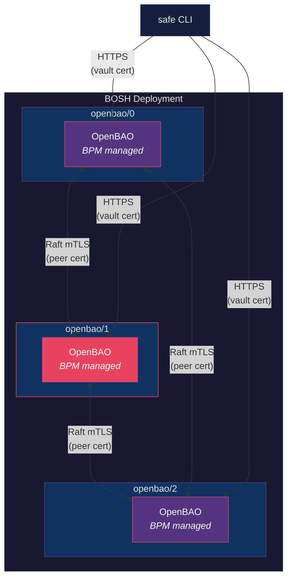

# OpenBAO Genesis Kit

Deploy highly available [OpenBAO](https://openbao.org) clusters on BOSH using
[Genesis](https://genesisproject.io).

OpenBAO is an open-source secrets management solution forked from HashiCorp
Vault. This kit deploys a 3-node cluster with integrated Raft storage, mutual
TLS between peers, and BPM process management — no Consul dependency required.

## Why OpenBAO?

OpenBAO provides the same API and operational model as Vault, with a fully
open-source license. The `safe` CLI works unchanged against OpenBAO, so
existing Genesis operator workflows (init, unseal, target, auth) carry over
without modification.

The shift from Consul-backed storage to integrated Raft simplifies the
deployment topology from six processes across two releases down to a single
OpenBAO process per node, managed by BPM.

## Prerequisites

- Genesis 3.1.0 or later

- A BOSH director with a cloud config that provides the target network, VM
  type, and disk type

- The `safe` CLI for operator interactions (init, unseal, target, auth)

## Quick Start

Create a new environment file:

```bash
genesis new my-env -k openbao
```

The wizard will ask whether this is your primary Genesis Vault. If not, it sets
`params.auxiliary_vault: true` to prevent cross-unseal conflicts.

Deploy:

```bash
genesis deploy my-env
```

On first deploy, the kit automatically initializes and unseals the cluster. The
seal keys are stored at `secret/vault/seal/keys` for automatic unsealing on
subsequent deploys.

After deployment, target and authenticate:

```bash
genesis do my-env -- target
```

## Supported Platforms

| Platform | Notes |
|----------|-------|
| AWS | Default; gp3 encrypted disks, IMDSv2 enforced |
| Azure | Availability set support via `azure_availability_set` param |
| GCP | Standard configuration |
| OpenStack | Boot-from-volume, configurable instance types |
| vSphere | Standard configuration |
| STACKIT | Boot-from-volume, security group integration |

## Architecture



The leader node (highlighted) handles all writes. Followers replicate via Raft
consensus over mTLS using the dedicated peer certificate. Client access from
the `safe` CLI uses HTTPS with the vault certificate. A quorum of 2-of-3 nodes
is required for availability.

Each node runs a single OpenBAO process under BPM. Peer discovery is automatic
via BOSH links, and the leader is elected through Raft consensus.

## Operator Addons

| Addon | Shortcut | Description |
|-------|----------|-------------|
| `init` | `i` | Initialize the cluster (first deploy only) |
| `unseal` | `u` | Unseal with stored keys or manual entry |
| `seal` | `s` | Seal the cluster |
| `status` | `a` | Show health and seal state |
| `target` | `t` | Target and authenticate via `safe` |

Run addons with:

```bash
genesis do my-env -- init
genesis do my-env -- unseal
genesis do my-env -- status
genesis do my-env -- target [auth-method]
```

## Configuration

Minimal environment file:

```yaml
---
kit:
  name:    openbao
  version: 1.0.0

genesis:
  env: us-east-prod

params: {}
```

All parameters have sensible defaults. Override as needed:

| Parameter | Default | Description |
|-----------|---------|-------------|
| `openbao_domain` | `openbao.bosh` | TLS certificate domain |
| `openbao_network` | `openbao` | BOSH network name |
| `openbao_vm_type` | `default` | BOSH VM type |
| `openbao_disk_type` | `default` | BOSH persistent disk type |
| `availability_zones` | `[z1, z2, z3]` | BOSH availability zones |
| `ui` | `true` | Enable the web UI |
| `log_level` | `info` | Server log verbosity |
| `default_lease_ttl` | `768h` | Default secret lease TTL |
| `max_lease_ttl` | `768h` | Maximum secret lease TTL |

See [MANUAL.md](MANUAL.md) for the complete parameter reference, OCFP and
Azure-specific parameters, cloud config details, and certificate management.

## Features

Enable features in your environment file:

```yaml
kit:
  features:
    - ocfp    # OCFP-managed infrastructure
    - azure   # Azure availability sets
    - stackit # STACKIT cloud platform
```

- **ocfp** — Derives network, VM type, and disk type names from the OCFP
  environment convention. Provides IPs and AZs from OCFP subnet configuration.

- **azure** — Restricts to a single AZ and configures an Azure availability
  set for the cluster nodes.

- **stackit** — Applies STACKIT-specific VM extension defaults.

## Certificate Lifecycle

The kit generates and manages three certificates:

| Certificate | Purpose | Validity |
|-------------|---------|----------|
| CA | Root certificate authority | 10 years |
| Peer | Raft inter-node mTLS | 10 years |
| Vault | Client-facing HTTPS | 2 years |

Genesis handles rotation automatically. The peer and vault certificates are
signed by the kit's root CA.

## Development

Run the spec tests:

```bash
cd spec/
go test ./...
```

Tests compile manifests against cloud config fixtures and compare the output to
expected results in `spec/results/`.

## Contributing

1. Fork the repository

2. Create a feature branch

3. Add or update spec tests for your changes

4. Submit a pull request

## License

Licensed under the [Apache License, Version 2.0](https://www.apache.org/licenses/LICENSE-2.0).
